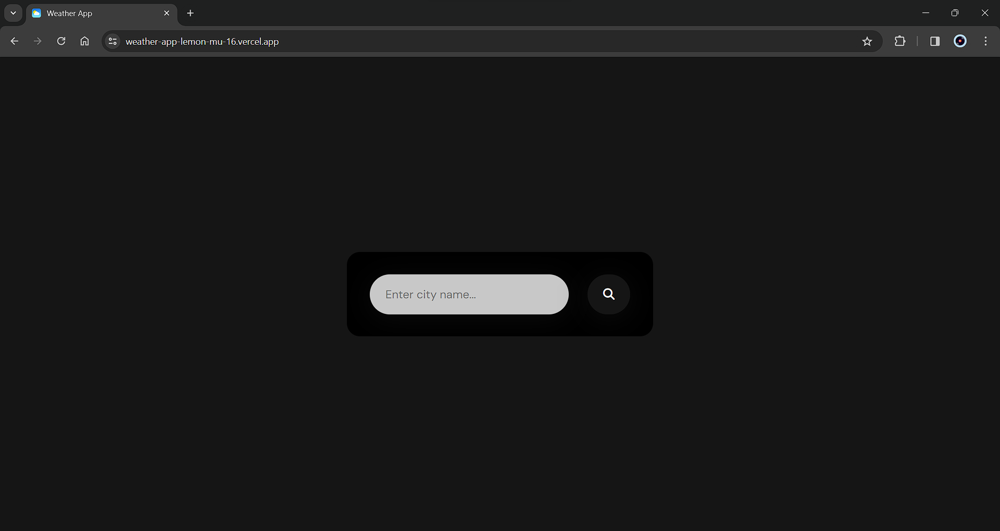
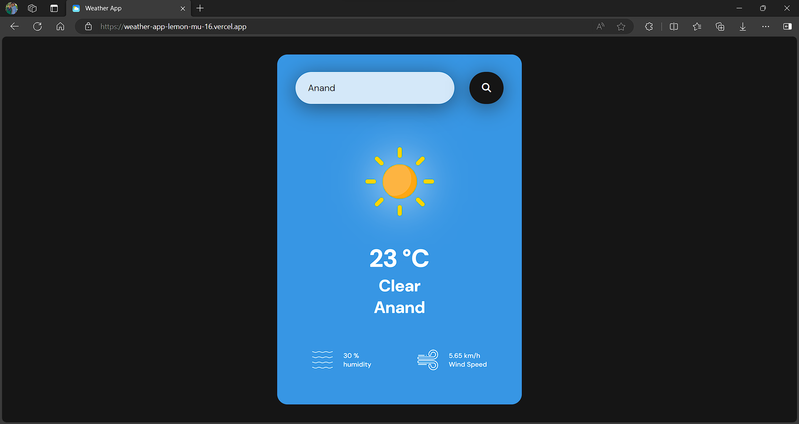

# Weather App ☁️📱

This is a simple weather web application that allows users to check the current weather conditions of a city. Users can input the name of the city they want to check, and the application retrieves weather data from the OpenWeatherMap API.

## Features 🌟

- **Weather Data Display**: Displays the current temperature, humidity, wind speed, and weather condition (e.g., cloudy, clear, rainy) of the specified city. 🌡️💧💨☁️
- **Dynamic Background and Icon**: Changes the background color and weather icon based on the current weather condition. 🖼️🌞🌧️🌦️
- **Error Handling**: Alerts the user if an incorrect city name is entered or if there is an issue with the internet connection. ❗🔍🌐

## Technologies Used 💻

- **HTML/CSS**: Provides the structure and styling for the web application.
- **JavaScript (ES6+)**: Implements the functionality of fetching weather data from the OpenWeatherMap API and updating the UI dynamically.
- **OpenWeatherMap API**: Retrieves current weather data based on the city name entered by the user.

## How to Use 🤔

1. Clone or download the repository to your local machine.
2. Open the `index.html` file in a web browser.
3. Enter the name of the city you want to check the weather for in the input field.
4. Click the "Search" button.
5. The weather information for the specified city will be displayed, including temperature, humidity, wind speed, and weather condition. 🌡️💧💨☁️
6. Additionally, the background color and weather icon will change based on the current weather condition to provide a visual representation of the weather. 🖼️🌞🌧️🌦️

## Deployment 🚀

This application is deployed on Vercel. [Click here to access it.](insert_vercel_deployment_link_here)

## Note 📝

- Ensure you have a stable internet connection for the application to fetch weather data from the API.
- Make sure to enter the correct city name to receive accurate weather information.
- Weather icons are provided under the `images` directory. You can replace them with your own icons if desired.

## Images 🖼️

## Author ✍️

Mayur Chauhan
